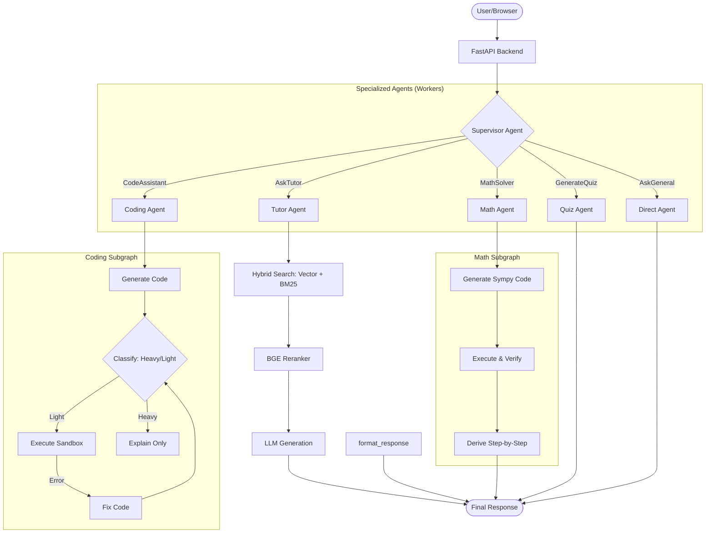

# AGENTS.md — Hướng dẫn cho AI Agent làm việc với dự án RAG QABot

> Tài liệu này mô tả kiến trúc, quy ước, và hướng dẫn cho các AI coding agent (Copilot, Gemini, Claude, v.v.) khi đọc hiểu và chỉnh sửa codebase.

---

Khi thực hiện bất kì plan trong docs nào cũng phải update lại kết quả đã thực hiện vào đúng phần docs đó.
Ví dụ: nếu đang làm plan trong `Change_Generation.md` thì sau khi hoàn thành mỗi checklist item, phải cập nhật vào phần `Checklist triển khai` trong file đó. Không cập nhật vào đây.

## 📌 Tổng quan dự án

**RAG QABot** (PUQ Q&A) là hệ thống hỏi đáp tự động cho các môn học tại UIT, sử dụng kiến trúc **Retrieval-Augmented Generation (RAG)** kết hợp với **Multi-Agent Supervisor**.

- **Ngôn ngữ chính**: Python 3.12+
- **Frontend**: React + Vite + TailwindCSS (`frontend/`)
- **Backend**: FastAPI (`src/api/server.py`)
- **LLM**: OpenAI GPT-4o-mini (qua LangChain `ChatOpenAI`)
- **Vector DB**: ChromaDB (persist tại `artifacts/database_semantic/`)
- **Embedding**: BAAI/bge-m3 (HuggingFace) hoặc OpenAI `text-embedding-3-small`
- **Reranker**: BAAI/bge-reranker-base (CrossEncoder)
- **Orchestration**: LangGraph (Multi-Agent Supervisor workflow)
- **Ngôn ngữ giao tiếp**: Tiếng Việt (comments, prompts, UI)

---

## 🏗️ Kiến trúc hệ thống

Hệ thống được thiết kế theo mô hình **Multi-Agent Supervisor** sử dụng LangGraph để điều phối các chuyên gia khác nhau xử lý yêu cầu người dùng.



### Chi tiết các Agent chuyên trách

1. **`Supervisor`**: "Bộ não" điều phối, sử dụng Tool Calling để phân loại câu hỏi và ủy quyền cho Agent phù hợp. Nó cũng thực hiện điều hướng cứng (Deterministic Steering) dựa trên pattern để tăng tốc.
2. **`Tutor` (RAG Core)**: Chuyên gia về kiến thức bài giảng. Sử dụng quy trình RAG chuẩn: Tìm kiếm Hybrid (Vector + Keyword) -> Tái xếp hạng (Reranker) -> Tổng hợp câu trả lời kèm citation.
3. **`Coding`**: Chuyên gia lập trình. Có khả năng tự sửa lỗi (Self-correction) bằng cách chạy code trong sandbox, bắt lỗi và yêu cầu LLM sửa lại cho đến khi thành công hoặc đạt giới hạn thử lại.
4. **`Math`**: Chuyên gia toán học. Sử dụng thư viện Sympy để giải toán chính xác thay vì chỉ dựa vào suy luận của LLM, sau đó trình bày lại các bước giải bằng LaTeX.
5. **`Quiz`**: Chuyên gia đánh giá. Trích xuất ngữ cảnh từ bài giảng để tạo ra các câu hỏi trắc nghiệm tương tác.
6. **`Direct`**: Xử lý các câu hỏi xã giao, chào hỏi hoặc kiến thức tổng quát không cần tra cứu dữ liệu chuyên ngành.

### LangGraph Workflow (Multi-Agent)

1. **`Supervisor`**: Phân loại yêu cầu người dùng (Chào hỏi, Học tập, Lập trình, Toán học, Quiz).
2. **`Tutor`**: Chạy pipeline RAG để trả lời kiến thức từ bài giảng.
3. **`Coding`**: Chuyên trách giải quyết các bài toán lập trình, có khả năng chạy code sandbox.
4. **`Math`**: Giải quyết các bài toán công thức, logic toán học.
5. **`Quiz`**: Tạo câu hỏi kiểm tra kiến thức dựa trên ngữ cảnh video.

---

## 📂 Cấu trúc thư mục & trách nhiệm module

```
final_project/
├── frontend/                       # ⚛️ React Frontend (Vite + TS)
├── src/
│   ├── api/                        # 🔌 Backend API (FastAPI)
│   │   ├── server.py               # Entry point
│   │   ├── router.py               # API Endpoints (/chat, /videos)
│   │   └── services/               # Logic nghiệp vụ (chat_service, summary_service)
│   │
│   ├── rag_core/                   # 🧠 Orchestration & Agents
│   │   ├── lang_graph_rag.py       # LangGraph definition & Supervisor
│   │   ├── agents/                 # Định nghĩa các chuyên gia (tutor, coding, math, quiz)
│   │   ├── tools/                  # Công cụ cho agents (sandbox, retrieval)
│   │   └── state.py                # Graph State definition
│   │
│   ├── retrieval/                  # 🔍 Retrieval components
│   │   ├── hybrid_search.py        # EnsembleRetriever (BM25 + Vector)
│   │   ├── keyword_search.py       # BM25 keyword search
│   │   ├── reranking.py            # CrossEncoder reranker
│   │   └── text_splitters/         # Logic chia nhỏ văn bản (Semantic/Recursive)
│   │
│   ├── data_pipeline/              # 📥 Data ingestion (Crawl → Process → Embed)
│   │   └── pipeline.py             # End-to-end pipeline
│   │
│   ├── storage/                    # 📦 Vector DB management
│   │   └── vectorstore.py          # ChromaDB wrapper
│   │
│   └── generation/                 # 🤖 LLM Factory
│       └── llm_model.py            # Khởi tạo ChatOpenAI
│
├── artifacts/                      # 🗂️ Runtime artifacts (Nằm ngoài src)
│   ├── data/                       # Transcript raw/processed
│   ├── database_semantic/          # ChromaDB persistent storage
│   ├── videos/                     # Metadata & Thumbnails video
│   └── chunks/                     # Cached text chunks
│
├── config.yaml                     # Danh sách playlist YouTube
└── .env                            # Cấu hình API Keys
```

---

## 🔑 Biến môi trường (`.env`)

| Biến | Mục đích |
|------|----------|
| `myAPIKey` | OpenAI API key (Bắt buộc) |
| `OPENAI_MODEL` | Model chính (mặc định `gpt-4o-mini`) |
| `YOUTUBE_API_KEY` | Dùng khi crawl playlist mới |
| `PUQ_DATA_DIR` | Đường dẫn `artifacts/data` |
| `PUQ_VECTOR_DB_DIR` | Đường dẫn `artifacts/database_semantic` |

---

## ⚙️ Quy ước code

### Ngôn ngữ & phong cách
- **Comments và docstrings**: Viết bằng **tiếng Việt**.
- **Tên biến/hàm**: Tiếng Anh, snake_case.
- **Tên class**: PascalCase.
- **Import style**: Absolute imports (`from src.rag_core.state import State`).

### Format response từ RAG
Hệ thống sử dụng streaming JSON. Kết quả cuối cùng thường bao gồm:
```python
{
    "text": str,              # Nội dung Markdown
    "video_url": List[str],   # Citation links
    "type": "rag" | "direct" | "coding" | "math"
}
```

---

## 🧪 Cách chạy & test

### Chạy development
```bash
# Terminal 1 — Backend
uvicorn src.api.server:app --host 0.0.0.0 --port 8000 --reload

# Terminal 2 — Frontend
cd frontend
npm run dev
```

### Cập nhật dữ liệu
```bash
python -m src.data_pipeline.pipeline
```

---

## ⚠️ Lưu ý khi chỉnh sửa

### Không nên thay đổi
- **Cấu trúc State**: `src/rag_core/state.py` ảnh hưởng đến toàn bộ các Agent.
- **Prompt System**: Các prompt trong `agents/` đã được tối ưu hóa cho tiếng Việt.

### Cần lưu ý
- **JsonStreamCleaner**: Trong `chat_service.py` xử lý việc tách JSON ra khỏi stream văn bản của LLM.
- **Supervisor Routing**: Logic quyết định Agent nào xử lý nằm trong `lang_graph_rag.py`.

---

## 🔧 Patterns thường gặp

### Thêm Agent mới
1. Định nghĩa Agent logic trong `src/rag_core/agents/{agent_name}.py`.
2. Thêm Agent vào supervisor routing trong `src/rag_core/lang_graph_rag.py`.
3. Định nghĩa các tool cần thiết trong `src/rag_core/tools/`.

### Cập nhật Retrieval logic
1. Sửa đổi trong `src/retrieval/hybrid_search.py` để thay đổi cách tìm kiếm.
2. Điều chỉnh reranker trong `src/retrieval/reranking.py`.

### Thêm data source mới
1. Tạo fetcher mới trong `src/data_pipeline/`.
2. Cập nhật `pipeline.py` để tích hợp nguồn dữ liệu mới.

---

## 📊 Hiệu năng & giới hạn

- **RAM**: Backend + embedding models cần ~4GB.
- **Response time**: ~5-15s tùy thuộc vào OpenAI API và độ phức tạp của câu hỏi.
- **Request timeout**: Frontend timeout 360s.

---

## 📁 Files quan trọng nhất

1. `src/rag_core/lang_graph_rag.py` — Trung tâm điều phối hệ thống.
2. `src/api/services/chat_service.py` — Xử lý luồng stream và hội thoại.
3. `src/rag_core/agents/` — Chứa logic của từng "chuyên gia".
4. `src/retrieval/hybrid_search.py` — Logic tìm kiếm dữ liệu.

---

# 1. Think Before Coding

**Don't assume. Don't hide confusion. Surface tradeoffs.**

Before implementing:
- State your assumptions explicitly. If uncertain, ask.
- If multiple interpretations exist, present them - don't pick silently.
- If a simpler approach exists, say so. Push back when warranted.
- If something is unclear, stop. Name what's confusing. Ask.

## 2. Simplicity First

**Minimum code that solves the problem. Nothing speculative.**

- No features beyond what was asked.
- No abstractions for single-use code.
- No "flexibility" or "configurability" that wasn't requested.
- No error handling for impossible scenarios.
- If you write 200 lines and it could be 50, rewrite it.

Ask yourself: "Would a senior engineer say this is overcomplicated?" If yes, simplify.

## 3. Surgical Changes

**Touch only what you must. Clean up only your own mess.**

When editing existing code:
- Don't "improve" adjacent code, comments, or formatting.
- Don't refactor things that aren't broken.
- Match existing style, even if you'd do it differently.
- If you notice unrelated dead code, mention it - don't delete it.

When your changes create orphans:
- Remove imports/variables/functions that YOUR changes made unused.
- Don't remove pre-existing dead code unless asked.

The test: Every changed line should trace directly to the user's request.

## 4. Goal-Driven Execution

**Define success criteria. Loop until verified.**

Transform tasks into verifiable goals:
- "Add validation" → "Write tests for invalid inputs, then make them pass"
- "Fix the bug" → "Write a test that reproduces it, then make it pass"
- "Refactor X" → "Ensure tests pass trước và sau"

For multi-step tasks, state a brief plan:
```
1. [Step] → verify: [check]
2. [Step] → verify: [check]
3. [Step] → verify: [check]
```

Strong success criteria let you loop independently. Weak criteria ("make it work") require constant clarification.

---

**These guidelines are working if:** fewer unnecessary changes in diffs, fewer rewrites due to overcomplication, và clarifying questions come before implementation ra mắt sau mistakes.
