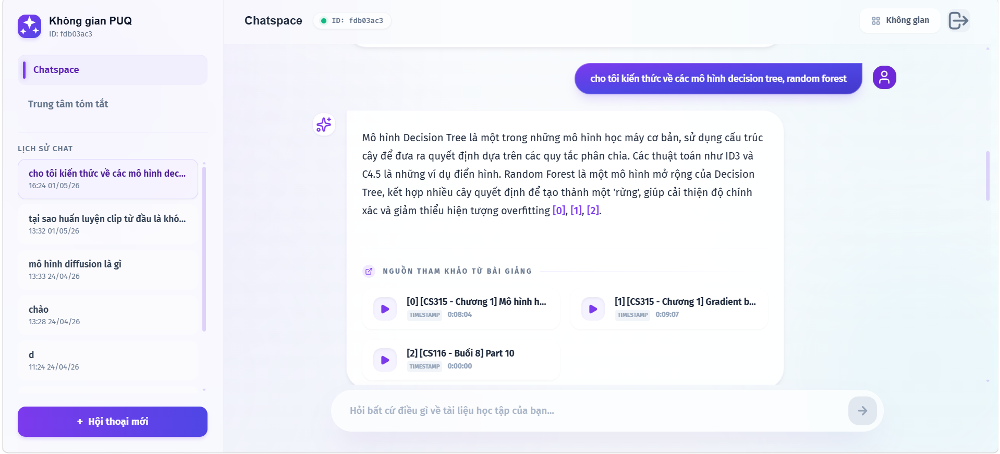
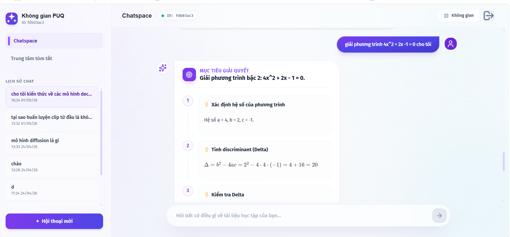
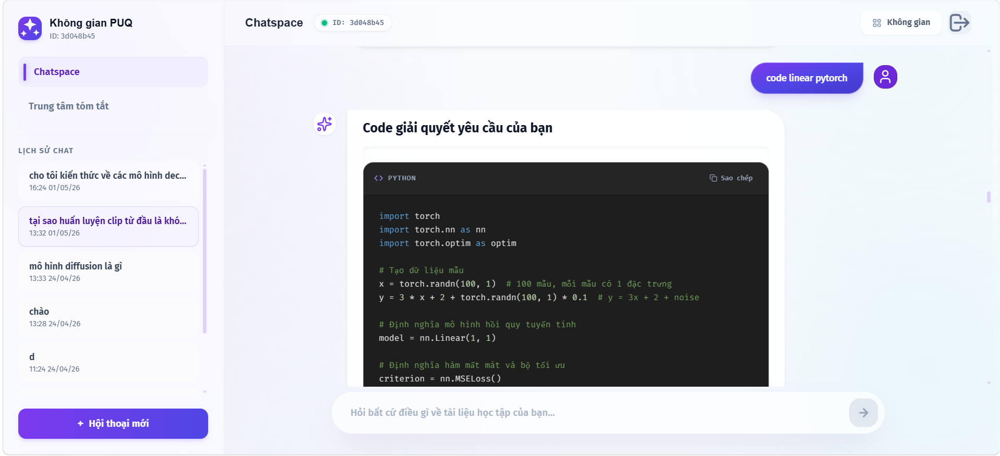
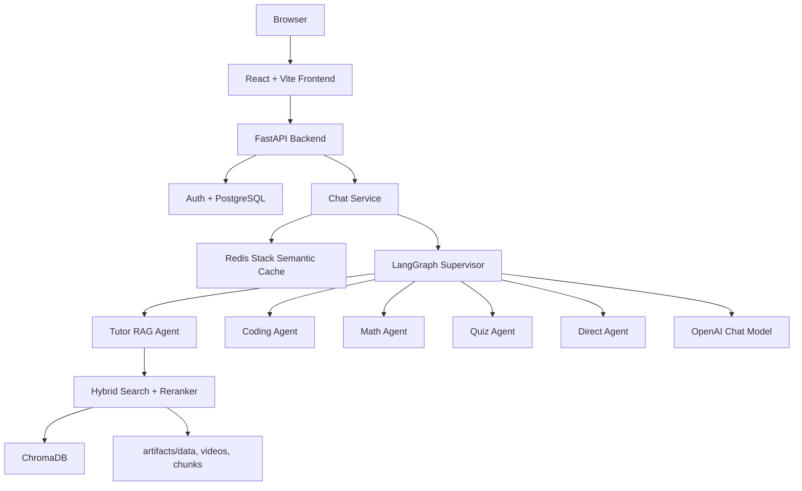

# RAG QABot — Multi-Agent Lecture QA System

PUQ Q&A là hệ thống hỏi đáp bài giảng cho sinh viên UIT, kết hợp **Retrieval-Augmented Generation (RAG)**, **LangGraph Multi-Agent Supervisor**, FastAPI backend, React frontend, PostgreSQL và Redis semantic cache.

Mục tiêu: người dùng có thể hỏi về nội dung bài giảng/video, nhận câu trả lời tiếng Việt có citation, hoặc chuyển sang các tác vụ chuyên biệt như giải toán, hỗ trợ code và tạo quiz.

## Demo Preview

| Chat Interface | Multi-Agent Workflow |
|---|---|
|  |  |



---


## Chạy nhanh bằng Docker

Docker Compose hiện chạy theo **profiles** để tách container rõ ràng:

```txt
frontend       -> React/Vite dev server, http://localhost:5173
api-cpu        -> FastAPI/RAG CPU, http://localhost:8000
api-gpu        -> FastAPI/RAG GPU local, http://localhost:8000
redis-stack    -> Redis Stack + RedisInsight, http://localhost:8001
pipeline-cpu   -> Data pipeline CPU, chạy khi cần ingest dữ liệu
pipeline-gpu   -> Data pipeline GPU, chạy khi cần ingest dữ liệu bằng GPU
```

> Frontend và backend là **2 container riêng**, nhưng được quản lý chung trong `docker-compose.yaml`.

### 1. Chuẩn bị `.env`

```powershell
Copy-Item .env.example .env
```

Sau đó điền các biến cần thiết như `myAPIKey`, `DATABASE_URL`, `JWT_SECRET`, `REDIS_URL`.

### 2. Chạy local CPU: frontend + backend + Redis

```powershell
docker compose --profile cpu --profile frontend --profile redis up --build
```

Truy cập:

```txt
Frontend:     http://localhost:5173
Backend API:  http://localhost:8000
RedisInsight: http://localhost:8001
```

### 3. Chạy local GPU: backend GPU + Redis

Dùng khi máy local có NVIDIA GPU, Docker Desktop đã bật GPU support/NVIDIA Container Toolkit.

```powershell
docker compose --profile gpu --profile redis up --build
```

Image GPU đã test build local:

```txt
rag-qabot:gpu = 12.5GB
```

Nếu muốn chạy frontend cùng lúc với backend GPU, hiện frontend proxy mặc định trỏ `api-cpu`; cách đơn giản nhất là chạy frontend ngoài Docker:

```powershell
npm --prefix frontend run dev
```

Hoặc chỉnh `VITE_API_PROXY_TARGET=http://api-gpu:8000` trong service `frontend` trước khi chạy profile `frontend` cùng `gpu`.

### 4. Chạy data pipeline bằng Docker

CPU pipeline:

```powershell
docker compose --profile pipeline run --rm pipeline-cpu
```

GPU pipeline:

```powershell
docker compose --profile pipeline-gpu run --rm pipeline-gpu
```

Pipeline image chứa OCR/Whisper/video dependencies nặng, được tách riêng khỏi image deploy API.

### 5. Build image riêng nếu cần đo size

CPU runtime:

```powershell
docker build --target prod-cpu -t rag-qabot:cpu-runtime .
docker images rag-qabot:cpu-runtime
```

GPU runtime/dev:

```powershell
docker build --target dev-gpu -t rag-qabot:gpu .
docker images rag-qabot:gpu
```

Size đã đo gần nhất:

```txt
rag-qabot:cpu-runtime = 3.97GB
rag-qabot:gpu         = 12.5GB
```

---

## Tài khoản demo

```txt
Email: nguyenlam.baophuc@gmail.com
Password: 123456789
```

---

## Tính năng chính

- **Chat RAG tiếng Việt**: hỏi đáp từ transcript bài giảng.
- **Citation video**: trả link/timestamp nguồn khi có context phù hợp.
- **Multi-Agent Supervisor**: tự route sang tutor, coding, math, quiz hoặc direct.
- **Math Agent**: dùng SymPy để tính toán rồi trình bày lại bằng LaTeX.
- **Coding Agent**: sinh, chạy và tự sửa code trong sandbox khi phù hợp.
- **Quiz Agent**: tạo câu hỏi trắc nghiệm từ nội dung học.
- **Summary Hub**: xem danh sách video và tóm tắt nội dung.
- **Auth + History**: đăng nhập, lưu session và lịch sử chat trong PostgreSQL.
- **Redis semantic cache**: cache exact/semantic response để giảm latency và token.

---

## Kiến trúc tổng quan



---

## Cấu trúc thư mục chính

```txt
final_project/
├── backend/                 # Modular FastAPI app: auth, chat, DB, Redis cache
├── frontend/                # React + Vite UI: Chatspace, Summary Hub, auth pages
├── src/                     # AI/RAG engine: LangGraph, agents, retrieval, pipeline
├── artifacts/               # Runtime data: transcripts, chunks, ChromaDB, videos
├── docs/                    # Design docs, upgrade plans, architecture notes
├── tests/                   # Test/smoke scripts cấp project
├── requirements.txt         # Dependencies cho AI/RAG engine
├── backend/requirements.txt # Dependencies riêng backend API service
├── config.yaml              # Playlist/source config cho data pipeline
└── .env.example             # Mẫu biến môi trường
```

---

## Các README theo khu vực

- [backend/README.md](backend/README.md): FastAPI, PostgreSQL, Redis, auth, chat API.
- [src/README.md](src/README.md): AI engine, LangGraph agents, retrieval và pipeline.
- [frontend/README.md](frontend/README.md): React UI, cấu trúc component, scripts.
- [src/rag_core/README.md](src/rag_core/README.md): Supervisor và agent workflow.
- [src/retrieval/README.md](src/retrieval/README.md): Hybrid search, BM25, reranking.
- [src/data_pipeline/README.md](src/data_pipeline/README.md): Crawl/xử lý dữ liệu bài giảng.
- [backend/app/core/cache/README.md](backend/app/core/cache/README.md): Redis semantic cache.

---

## Biến môi trường quan trọng

Copy `.env.example` thành `.env`, rồi điền các biến thực tế.

| Biến | Mục đích |
|---|---|
| `DATABASE_URL` | PostgreSQL/Supabase connection string |
| `JWT_SECRET` | Secret ký access/refresh token |
| `myAPIKey` | OpenAI API key cho LLM/embedding |
| `OPENAI_MODEL` | Model chat chính |
| `REDIS_URL` | Redis Stack URL, mặc định `redis://localhost:6379/0` |
| `SEMANTIC_CACHE_ENABLED` | Bật/tắt Redis semantic cache |
| `YOUTUBE_API_KEY` | Dùng khi crawl playlist YouTube |
| `PUQ_DATA_DIR` | Thư mục transcript/data |
| `PUQ_VECTOR_DB_DIR` | Thư mục ChromaDB |
| `PUQ_VIDEOS_DIR` | Thư mục metadata video |

---

## Workflow request chat

```txt
User gửi câu hỏi
  ↓
Frontend stream request tới /api/v1/chat/stream
  ↓
Backend lưu user message vào PostgreSQL
  ↓
Redis exact/semantic cache lookup
  ├─ Hit: stream response cache + lưu assistant vào DB
  └─ Miss: gọi LangGraph workflow
          ↓
      Supervisor route agent
          ↓
      Agent tạo response
          ↓
      Lưu assistant vào DB
          ↓
      Nếu cacheable thì ghi Redis
```

---

## Data/RAG workflow

```txt
YouTube/transcript data
  ↓
Data pipeline xử lý nội dung
  ↓
Chunking + metadata
  ↓
Embedding vào ChromaDB
  ↓
Runtime retrieval: vector + keyword
  ↓
Reranker chọn context tốt nhất
  ↓
Tutor agent sinh câu trả lời có citation
```

---

## Lệnh hữu ích

### Cài Python dependencies

```powershell
pip install -r requirements.txt
pip install -r backend/requirements.txt
```

### Chạy backend

```powershell
python -m uvicorn backend.app.main:app --host 0.0.0.0 --port 8000 --reload
```

### Chạy frontend

```powershell
npm --prefix frontend install
npm --prefix frontend run dev
```

### Chạy data pipeline

```powershell
python -m src.data_pipeline.pipeline
```

### Compile nhanh Python files đã sửa

```powershell
python -m compileall backend/app src
```

---

## Lưu ý vận hành

- PostgreSQL là **source of truth** cho user, session và chat history.
- Redis chỉ là cache; mất Redis thì có thể rebuild từ DB bằng prewarm.
- `artifacts/` là runtime data lớn, thường không commit toàn bộ.
- Backend startup sẽ prewarm RAG resources và Redis cache ở background.
- Prompt/response/UI ưu tiên tiếng Việt.

---

## Tài liệu nâng cấp liên quan

- [Redis plan](docs/upgrade_system/redis.md)
- [Redis architecture](docs/upgrade_system/redis_architecture.md)
- [Deployment notes](DEPLOYMENT.md)
- [Agent rules](AGENTS.md)
