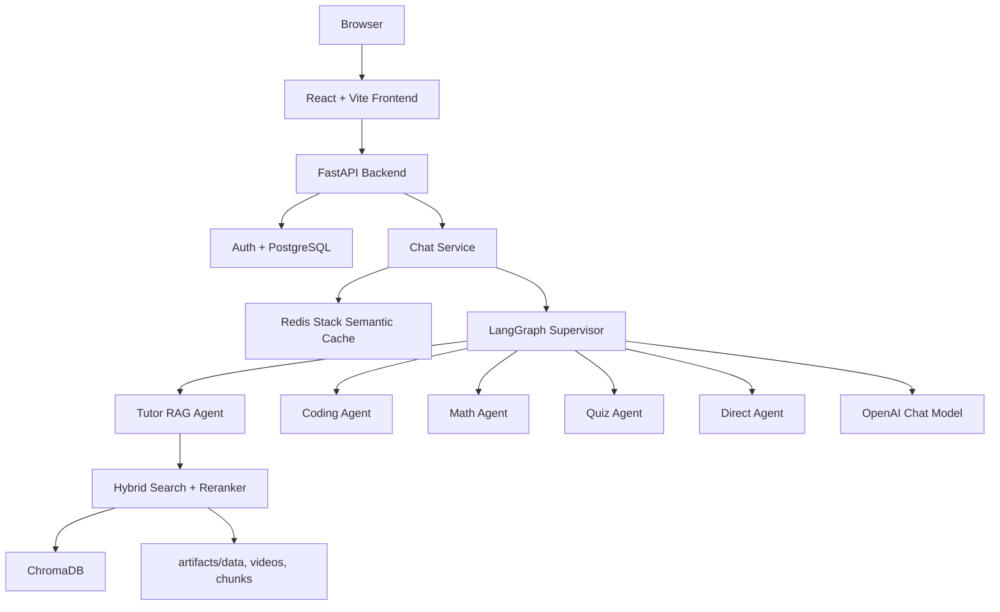

# RAG QABot — Multi-Agent Lecture QA System

[Tiếng Việt](README_VI.md)

PUQ Q&A is a lecture question-answering system for UIT students. It combines **Retrieval-Augmented Generation (RAG)**, a **LangGraph Multi-Agent Supervisor**, a FastAPI backend, a React frontend, PostgreSQL, and Redis semantic caching.

The goal is to let users ask questions about lecture/video content, receive Vietnamese answers with citations, or switch to specialized tasks such as math solving, coding support, and quiz generation.

## Demo Preview

| Chat Interface | Multi-Agent Workflow |
|---|---|
|  |  |


---

## Quick Start with Docker

Docker Compose uses **profiles** to separate services clearly:

```txt
frontend       -> React/Vite dev server, http://localhost:5173
api-cpu        -> FastAPI/RAG CPU, http://localhost:8000
api-gpu        -> FastAPI/RAG local GPU, http://localhost:8000
redis-stack    -> Redis Stack + RedisInsight, http://localhost:8001
pipeline-cpu   -> CPU data pipeline, used when ingesting data
pipeline-gpu   -> GPU data pipeline, used when ingesting data with GPU support
```

> Frontend and backend run as **two separate containers**, managed together by `docker-compose.yaml`.

### 1. Prepare `.env`

```powershell
Copy-Item .env.example .env
```

Then fill in the required values such as `myAPIKey`, `DATABASE_URL`, `JWT_SECRET`, and `REDIS_URL`.

### 2. Run local CPU stack: frontend + backend + Redis

```powershell
docker compose --profile cpu --profile frontend --profile redis up --build
```

Open:

```txt
Frontend:     http://localhost:5173
Backend API:  http://localhost:8000
RedisInsight: http://localhost:8001
```

### 3. Run local GPU stack: GPU backend + Redis

Use this when your local machine has an NVIDIA GPU and Docker Desktop GPU support/NVIDIA Container Toolkit is enabled.

```powershell
docker compose --profile gpu --profile redis up --build
```

This command starts **2 services**: `api-gpu` and `redis-stack`.

To run **3 services** together (frontend + GPU backend + Redis):

```powershell
docker compose --profile gpu --profile redis --profile frontend up --build
```

Locally tested GPU image size:

```txt
rag-qabot:gpu = 12.5GB
```

### 4. Run the data pipeline with Docker

CPU pipeline:

```powershell
docker compose --profile pipeline run --rm pipeline-cpu
```

GPU pipeline:

```powershell
docker compose --profile pipeline-gpu run --rm pipeline-gpu
```

The pipeline image contains heavy OCR/Whisper/video dependencies and is separated from the API deployment image.

### 5. Build standalone images for size checks

CPU runtime:

```powershell
docker build --target prod-cpu -t rag-qabot:cpu-runtime .
docker images rag-qabot:cpu-runtime
```

GPU runtime/dev:

```powershell
docker build --target dev-gpu -t rag-qabot:gpu .
docker images rag-qabot:gpu
```

Latest measured sizes:

```txt
rag-qabot:cpu-runtime = 3.97GB
rag-qabot:gpu         = 12.5GB
```

---

## Demo Account

```txt
Email: nguyenlam.baophuc@gmail.com
Password: 123456789
```

---

## Key Features

- **Vietnamese RAG chat**: answer questions from lecture transcripts.
- **Video citations**: return source links/timestamps when relevant context is found.
- **Multi-Agent Supervisor**: routes requests to tutor, coding, math, quiz, or direct agents.
- **Math Agent**: uses SymPy for calculation and explains results with LaTeX.
- **Coding Agent**: generates, executes, and self-corrects code in a sandbox when appropriate.
- **Quiz Agent**: generates multiple-choice questions from learning content.
- **Summary Hub**: browse videos and lecture summaries.
- **Auth + History**: login, sessions, and chat history stored in PostgreSQL.
- **Redis semantic cache**: exact/semantic response caching to reduce latency and token usage.

---

## Architecture Overview



---

## Main Directory Structure

```txt
final_project/
├── backend/                 # Modular FastAPI app: auth, chat, DB, Redis cache
├── frontend/                # React + Vite UI: Chatspace, Summary Hub, auth pages
├── src/                     # AI/RAG engine: LangGraph, agents, retrieval, pipeline
├── artifacts/               # Runtime data: transcripts, chunks, ChromaDB, videos
├── docs/                    # Design docs, upgrade plans, architecture notes
├── tests/                   # Project-level tests and smoke scripts
├── requirements.txt         # Dependencies for the AI/RAG engine
├── backend/requirements.txt # Backend API service dependencies
├── config.yaml              # Playlist/source config for the data pipeline
└── .env.example             # Environment variable template
```

---

## Area-Specific READMEs

- [backend/README.md](backend/README.md): FastAPI, PostgreSQL, Redis, auth, chat API.
- [src/README.md](src/README.md): AI engine, LangGraph agents, retrieval, and pipeline.
- [frontend/README.md](frontend/README.md): React UI, component structure, scripts.
- [src/rag_core/README.md](src/rag_core/README.md): Supervisor and agent workflow.
- [src/retrieval/README.md](src/retrieval/README.md): Hybrid search, BM25, reranking.
- [src/data_pipeline/README.md](src/data_pipeline/README.md): Lecture crawling and data processing.
- [backend/app/core/cache/README.md](backend/app/core/cache/README.md): Redis semantic cache.

---

## Important Environment Variables

Copy `.env.example` to `.env`, then fill in real values.

| Variable | Purpose |
|---|---|
| `DATABASE_URL` | PostgreSQL/Supabase connection string |
| `JWT_SECRET` | Secret used to sign access/refresh tokens |
| `myAPIKey` | OpenAI API key for LLM/embedding |
| `OPENAI_MODEL` | Main chat model |
| `REDIS_URL` | Redis Stack URL, default `redis://localhost:6379/0` |
| `SEMANTIC_CACHE_ENABLED` | Enable/disable Redis semantic cache |
| `YOUTUBE_API_KEY` | Used when crawling YouTube playlists |
| `PUQ_DATA_DIR` | Transcript/data directory |
| `PUQ_VECTOR_DB_DIR` | ChromaDB directory |
| `PUQ_VIDEOS_DIR` | Video metadata directory |

---

## Chat Request Workflow

```txt
User sends a question
  ↓
Frontend streams request to /api/v1/chat/stream
  ↓
Backend stores user message in PostgreSQL
  ↓
Redis exact/semantic cache lookup
  ├─ Hit: stream cached response + store assistant message in DB
  └─ Miss: call LangGraph workflow
          ↓
      Supervisor routes to an agent
          ↓
      Agent generates response
          ↓
      Store assistant message in DB
          ↓
      Cache in Redis when cacheable
```

---

## Data/RAG Workflow

```txt
YouTube/transcript data
  ↓
Data pipeline processes content
  ↓
Chunking + metadata
  ↓
Embedding into ChromaDB
  ↓
Runtime retrieval: vector + keyword
  ↓
Reranker selects best context
  ↓
Tutor agent generates answer with citations
```

---

## Useful Commands

### Install Python dependencies

```powershell
pip install -r requirements.txt
pip install -r backend/requirements.txt
```

### Run backend

```powershell
python -m uvicorn backend.app.main:app --host 0.0.0.0 --port 8000 --reload
```

### Run frontend

```powershell
npm --prefix frontend install
npm --prefix frontend run dev
```

### Run Redis locally

If Redis is already installed locally:

```powershell
redis-server
```

Or use Docker:

```powershell
docker compose --profile redis up -d redis-stack
```

Local Redis endpoint:

```txt
REDIS_URL=redis://localhost:6379/0
RedisInsight: http://localhost:8001
```

### Run data pipeline

```powershell
python -m src.data_pipeline.pipeline
```

### Quick compile check for modified Python files

```powershell
python -m compileall backend/app src
```

---

## Operational Notes

- PostgreSQL is the **source of truth** for users, sessions, and chat history.
- Redis is only a cache; if Redis data is lost, it can be rebuilt from the database via prewarm.
- `artifacts/` stores large runtime data and is usually not fully committed.
- Backend startup prewarms RAG resources and Redis cache in the background.
- Prompts, responses, and UI prioritize Vietnamese.

---

## Related Upgrade Documentation

- [Redis plan](docs/upgrade_system/redis.md)
- [Redis architecture](docs/upgrade_system/redis_architecture.md)
- [Deployment notes](DEPLOYMENT.md)
- [Agent rules](AGENTS.md)
