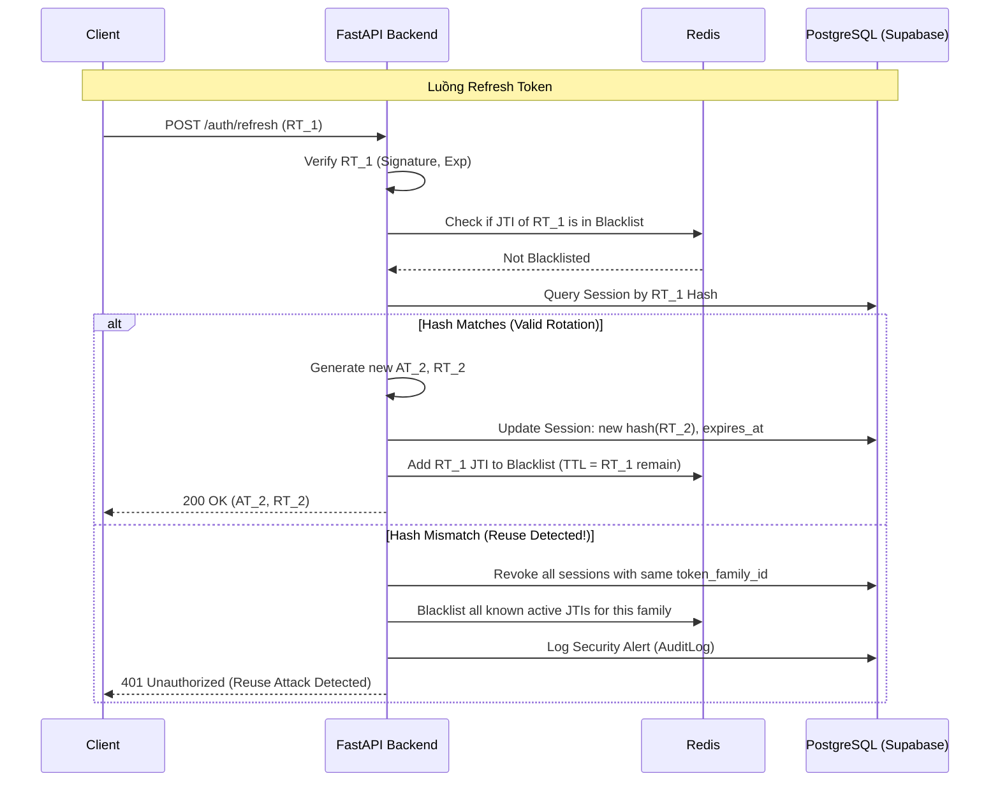

# Detailed Technical Design - Backend RAG QABot

Tài liệu này chi tiết hóa việc triển khai Backend dựa trên bản nghiên cứu `backend_research.md`.
Stack: FastAPI + SQLAlchemy 2.0 + PostgreSQL (Supabase) + Redis (Upstash).

---

## 0. Kiến trúc tổng thể (Đã chốt)

### Quyết định kiến trúc: Modular Monolith

Chúng ta chọn kiến trúc **Modular Monolith** — một server duy nhất nhưng được tổ chức theo Module nghiêm ngặt, giúp dễ scale và tách Microservice sau này nếu cần.

```
final_project/
├── backend/                 ← ✅ [MỚI] FastAPI Server chính
│   ├── app/
│   │   ├── main.py          ← Entry point (thay thế src/api/server.py)
│   │   ├── api/
│   │   │   └── v1/
│   │   │       ├── endpoints/
│   │   │       │   ├── auth.py      ← /auth/login, /auth/register, /auth/refresh
│   │   │       │   ├── chat.py      ← /chat/stream (yêu cầu Auth)
│   │   │       │   ├── videos.py    ← /videos (danh sách video)
│   │   │       │   └── users.py     ← /users/me, /users/profile
│   │   │       └── router.py        ← Gộp tất cả endpoints
│   │   ├── core/
│   │   │   ├── config.py    ← Đọc biến ENV (Pydantic Settings)
│   │   │   └── security.py  ← Sign/verify JWT, bcrypt password
│   │   ├── db/
│   │   │   ├── session.py   ← SQLAlchemy engine + SessionLocal
│   │   │   └── redis.py     ← Upstash Redis client
│   │   ├── models/
│   │   │   ├── user.py      ← User, UserProfile, UserSession, AuditLog
│   │   │   └── chat.py      ← ChatHistory (lưu lịch sử câu hỏi)
│   │   ├── services/
│   │   │   ├── auth.py      ← Logic JWT Rotation, Reuse Detection
│   │   │   ├── chat.py      ← Logic xử lý stream, Semantic Cache
│   │   │   └── user.py      ← CRUD user
│   │   └── deps.py          ← get_current_user, get_db, get_redis
│   ├── docs/                ← Tài liệu thiết kế (file này)
│   └── requirements.txt     ← Dependencies riêng cho backend
│
├── src/                     ← ✅ [GIỮ NGUYÊN] AI Engine thuần túy
│   ├── rag_core/            ← LangGraph, Agents, Supervisor
│   ├── storage/             ← ChromaDB wrapper
│   ├── retrieval/           ← Hybrid Search, Reranker
│   ├── generation/          ← LLM factory
│   └── data_pipeline/       ← Crawl & Embed pipeline
│
└── frontend/                ← React + Vite
```

### Luồng gọi (Call Flow)
```
Frontend
  │ POST /api/v1/chat/stream
  ▼
backend/app/api/v1/endpoints/chat.py   ← Xác thực JWT, Rate Limit
  │
  ▼
backend/app/services/chat.py           ← Check Semantic Cache (Redis)
  │  Cache MISS                         Cache HIT → trả về ngay
  ▼
src/rag_core/lang_graph_rag.py         ← Gọi AI Engine
  │
  ▼
backend/app/services/chat.py           ← Lưu kết quả vào Cache + DB
  │
  ▼
Frontend (SSE Stream)
```

---

## 1. Schema & Quan hệ (SQLAlchemy 2.0)

Chúng ta sử dụng SQLAlchemy 2.0 với kiểu gợi ý (type hints) mạnh mẽ.

```python
from datetime import datetime
from typing import List, Optional
import uuid
from sqlalchemy import ForeignKey, String, Boolean, DateTime, Text, JSON, BigInteger
from sqlalchemy.orm import DeclarativeBase, Mapped, mapped_column, relationship

class Base(DeclarativeBase):
    pass

class User(Base):
    __tablename__ = "users"

    id: Mapped[uuid.UUID] = mapped_column(primary_key=True, default=uuid.uuid4)
    email: Mapped[str] = mapped_column(String(255), unique=True, index=True, nullable=False)
    username: Mapped[str] = mapped_column(String(50), unique=True, index=True, nullable=False)
    password_hash: Mapped[str] = mapped_column(String(255), nullable=False)
    role: Mapped[str] = mapped_column(String(20), default="user") # 'user' | 'admin'
    is_active: Mapped[bool] = mapped_column(Boolean, default=True)
    is_verified: Mapped[bool] = mapped_column(Boolean, default=False)
    last_login_at: Mapped[Optional[datetime]] = mapped_column(DateTime, nullable=True)
    created_at: Mapped[datetime] = mapped_column(DateTime, default=datetime.utcnow)
    updated_at: Mapped[datetime] = mapped_column(DateTime, default=datetime.utcnow, onupdate=datetime.utcnow)

    profile: Mapped["UserProfile"] = relationship(back_populates="user", uselist=False)
    sessions: Mapped[List["UserSession"]] = relationship(back_populates="user", cascade="all, delete-orphan")
    chat_history: Mapped[List["ChatHistory"]] = relationship(back_populates="user", cascade="all, delete-orphan")

class UserProfile(Base):
    __tablename__ = "user_profiles"

    user_id: Mapped[uuid.UUID] = mapped_column(ForeignKey("users.id"), primary_key=True)
    full_name: Mapped[Optional[str]] = mapped_column(String(100))
    avatar_url: Mapped[Optional[str]] = mapped_column(String(255))
    bio: Mapped[Optional[str]] = mapped_column(Text)
    updated_at: Mapped[datetime] = mapped_column(DateTime, default=datetime.utcnow, onupdate=datetime.utcnow)

    user: Mapped["User"] = relationship(back_populates="profile")

class UserSession(Base):
    __tablename__ = "user_sessions"

    id: Mapped[uuid.UUID] = mapped_column(primary_key=True, default=uuid.uuid4)
    user_id: Mapped[uuid.UUID] = mapped_column(ForeignKey("users.id"), index=True)
    device_id: Mapped[str] = mapped_column(String(255), index=True)
    user_agent: Mapped[Optional[str]] = mapped_column(String(500))
    ip_address: Mapped[Optional[str]] = mapped_column(String(45))

    # Security: JWT Rotation fields
    refresh_token_hash: Mapped[str] = mapped_column(String(255), nullable=False)
    token_family_id: Mapped[uuid.UUID] = mapped_column(index=True, nullable=False)

    expires_at: Mapped[datetime] = mapped_column(DateTime, nullable=False)
    revoked_at: Mapped[Optional[datetime]] = mapped_column(DateTime, nullable=True)
    created_at: Mapped[datetime] = mapped_column(DateTime, default=datetime.utcnow)

    user: Mapped["User"] = relationship(back_populates="sessions")

class ChatHistory(Base):
    """Lưu trữ lịch sử hội thoại của user."""
    __tablename__ = "chat_history"

    id: Mapped[uuid.UUID] = mapped_column(primary_key=True, default=uuid.uuid4)
    user_id: Mapped[uuid.UUID] = mapped_column(ForeignKey("users.id"), index=True)
    session_id: Mapped[str] = mapped_column(String(100), index=True)  # Grouping conversation
    role: Mapped[str] = mapped_column(String(20))  # 'user' | 'assistant'
    content: Mapped[str] = mapped_column(Text, nullable=False)
    agent_type: Mapped[Optional[str]] = mapped_column(String(50))  # 'rag' | 'coding' | 'math' | 'direct'
    metadata_json: Mapped[Optional[dict]] = mapped_column(JSON)  # citations, token_count, etc.
    created_at: Mapped[datetime] = mapped_column(DateTime, default=datetime.utcnow, index=True)

    user: Mapped["User"] = relationship(back_populates="chat_history")

class AuditLog(Base):
    __tablename__ = "audit_logs"

    id: Mapped[int] = mapped_column(BigInteger, primary_key=True, autoincrement=True)
    user_id: Mapped[Optional[uuid.UUID]] = mapped_column(ForeignKey("users.id"), nullable=True)
    action: Mapped[str] = mapped_column(String(100), index=True)
    metadata_json: Mapped[Optional[dict]] = mapped_column(JSON)
    created_at: Mapped[datetime] = mapped_column(DateTime, default=datetime.utcnow, index=True)
```

---

## 2. JWT Rotation & Redis Flow

### Cơ chế chống Reuse (Reuse Detection)
- **token_family_id**: Một ID duy nhất gắn với một chuỗi các Refresh Tokens từ lần đăng nhập đầu tiên.
- **refresh_token_hash**: Lưu hash của Refresh Token hiện tại đang hợp lệ trong DB.
- **Phát hiện Reuse**: Khi một Refresh Token cũ (đã được xoay vòng) được sử dụng lại:
    1. Backend nhận thấy hash không khớp với hash hiện tại trong `user_sessions`.
    2. Backend lập tức revoke toàn bộ `token_family_id`.
    3. User bị buộc đăng xuất trên tất cả thiết bị liên quan.

### Sơ đồ luồng JWT Rotation + Redis



---

## 3. Dependency Injection (FastAPI)

```python
# backend/app/deps.py
from fastapi import Depends, HTTPException, status
from fastapi.security import OAuth2PasswordBearer
from jose import jwt, JWTError
from sqlalchemy.orm import Session
from backend.app.core.security import ALGORITHM, SECRET_KEY
from backend.app.db.session import get_db
from backend.app.models.user import User

oauth2_scheme = OAuth2PasswordBearer(tokenUrl="api/v1/auth/login")

async def get_current_user(
    token: str = Depends(oauth2_scheme),
    db: Session = Depends(get_db)
) -> User:
    credentials_exception = HTTPException(
        status_code=status.HTTP_401_UNAUTHORIZED,
        detail="Could not validate credentials",
        headers={"WWW-Authenticate": "Bearer"},
    )
    try:
        payload = jwt.decode(token, SECRET_KEY, algorithms=[ALGORITHM])
        email: str = payload.get("sub")
        if email is None:
            raise credentials_exception
    except JWTError:
        raise credentials_exception

    user = db.query(User).filter(User.email == email).first()
    if user is None or not user.is_active:
        raise credentials_exception
    return user

async def get_admin_user(current_user: User = Depends(get_current_user)) -> User:
    if current_user.role != "admin":
        raise HTTPException(
            status_code=status.HTTP_403_FORBIDDEN,
            detail="The user doesn't have enough privileges"
        )
    return current_user
```

---

## 4. Exceptions & Status Codes

| Custom Exception | HTTP Status | Detail |
| :--- | :--- | :--- |
| `TokenExpired` | 401 | Token has expired |
| `InvalidToken` | 401 | Could not validate credentials |
| `SessionRevoked` | 401 | Session has been revoked due to security reasons |
| `UserNotActive` | 403 | User account is disabled |
| `RateLimitExceeded` | 429 | Too many requests, please try again later |
| `EmailAlreadyExists`| 409 | Email is already registered |

---

## 5. Chi tiết cấu hình Redis (Upstash)

**Nguyên tắc:** Redis chỉ là lớp tăng tốc/kiểm soát tạm thời; dữ liệu nguồn vẫn ở PostgreSQL trên Supabase.

| Key Pattern | Value | TTL | Mục đích |
| :--- | :--- | :--- | :--- |
| `auth:revoked_jti:{jti}` | `1` | Max 15m (AT) / 7d (RT) | Danh sách token bị thu hồi trước hạn |
| `auth:rate_limit:{action}:{ip}` | `counter` | 1m - 60m | Chống Brute-force & Spam |
| `cache:user:{user_id}` | `JSON` | 5m | Cache thông tin user cơ bản |
| `cache:chat:semantic` | `VectorIndex` | Permanent | **Semantic Cache**: Lưu vector embeddings của câu hỏi, trả kết quả khi câu hỏi tương đồng (>0.92 cosine similarity) |

### Semantic Cache Flow
```
User gửi câu hỏi
  → Embed câu hỏi thành vector
  → Tìm trong Redis VectorIndex (cosine similarity > 0.92)
  → HIT: Trả kết quả cache (< 50ms, không tốn tiền API)
  → MISS: Gọi AI → Lưu (embedding, answer) vào Redis → Trả về
```

---

## 6. Cấu trúc Module & Boilerplate

### `backend/app/core/security.py`
```python
from datetime import datetime, timedelta
from typing import Any, Union
from jose import jwt
from passlib.context import CryptContext
import os

pwd_context = CryptContext(schemes=["bcrypt"], deprecated="auto")

SECRET_KEY = os.getenv("JWT_SECRET")
ALGORITHM = os.getenv("JWT_ALGORITHM", "HS256")

def create_access_token(subject: Union[str, Any], expires_delta: timedelta = None) -> str:
    if expires_delta:
        expire = datetime.utcnow() + expires_delta
    else:
        expire = datetime.utcnow() + timedelta(minutes=int(os.getenv("ACCESS_TOKEN_EXPIRE_MINUTES", 30)))
    to_encode = {"exp": expire, "sub": str(subject), "type": "access"}
    return jwt.encode(to_encode, SECRET_KEY, algorithm=ALGORITHM)

def create_refresh_token(subject: Union[str, Any], sid: str, family_id: str) -> str:
    expire = datetime.utcnow() + timedelta(days=int(os.getenv("REFRESH_TOKEN_EXPIRE_DAYS", 7)))
    to_encode = {
        "exp": expire,
        "sub": str(subject),
        "sid": str(sid),
        "fid": str(family_id),
        "type": "refresh"
    }
    return jwt.encode(to_encode, SECRET_KEY, algorithm=ALGORITHM)

def verify_password(plain_password: str, hashed_password: str) -> bool:
    return pwd_context.verify(plain_password, hashed_password)

def get_password_hash(password: str) -> str:
    return pwd_context.hash(password)
```

### `backend/app/services/auth.py` (JWT Rotation Logic)
```python
async def rotate_refresh_token(db: Session, redis, old_rt: str):
    # 1. Decode & Verify RT
    payload = verify_rt(old_rt)
    sid = payload['sid']

    # 2. Query Session
    session = db.query(UserSession).filter(UserSession.id == sid).first()

    # 3. Reuse Detection
    if not session or hash_token(old_rt) != session.refresh_token_hash:
        if session:
            revoke_family(db, session.token_family_id)
        raise SecurityException("Token reuse detected")

    # 4. Rotate
    new_at = create_access_token(session.user.email)
    new_rt = create_refresh_token(session.user.email, sid, session.token_family_id)

    # 5. Update DB
    session.refresh_token_hash = hash_token(new_rt)
    db.commit()

    # 6. Blacklist old RT jti in Redis
    redis.setex(f"auth:revoked_jti:{payload['jti']}", payload['exp_remain'], "1")

    return new_at, new_rt
```

---

## 7. Checklist Triển khai

- [x] **Quyết định kiến trúc**: Modular Monolith, `backend/` + `src/`
- [x] **Quyết định DB**: PostgreSQL trên Supabase
- [x] **Quyết định Cache/Session**: Redis trên Upstash
- [x] **Thiết kế Schema**: User, UserSession, ChatHistory, AuditLog
- [x] **Thiết kế Bảo mật**: JWT Rotation + Reuse Detection (Sử dụng Argon2 hashing)
- [x] **Thiết kế Cache**: Semantic Cache (Vector-based) cho AI responses
- [x] **Cập nhật `.env`**: Tất cả biến môi trường đã được chuẩn hóa
- [x] **Phase 1**: Tạo cấu trúc thư mục `backend/app/` và cài dependencies
- [x] **Phase 2**: Implement DB connection + Models + Alembic migration (Đã chạy upgrade head)
- [/] **Phase 3**: Implement Auth endpoints (Register, Login, Refresh, Logout) — *Đang test & fix môi trường*
- [ ] **Phase 4**: Di chuyển toàn bộ logic từ `src/api` sang `backend/app/`
    - [ ] Di chuyển Services: `chat_service.py` ➔ `chat.py`, `summary_service.py` ➔ `summary.py`
    - [ ] Di chuyển Schemas: `src/api/schemas.py` ➔ `backend/app/schemas/`
    - [ ] Di chuyển Endpoints: `/chat`, `/videos`, `/summary` ➔ `backend/app/api/v1/endpoints/`
    - [ ] Tích hợp Redis Semantic Cache vào Chat Service
- [ ] **Phase 5**: Bảo vệ các endpoint bằng JWT middleware (Xác thực người dùng)
- [ ] **Phase 6**: Dọn dẹp `src/api` (Legacy Code) và Integration test với Frontend

---

## 8. Ghi chú kỹ thuật bổ sung

### Password Hashing
Do một số vấn đề về tương thích của thư viện `bcrypt` trong môi trường Windows/Anaconda hiện tại (lỗi độ dài password), hệ thống đã được chuyển sang sử dụng **Argon2** (`argon2-cffi`). Đây là thuật toán hashing hiện đại, an toàn hơn và có tính tương thích cao hơn.
