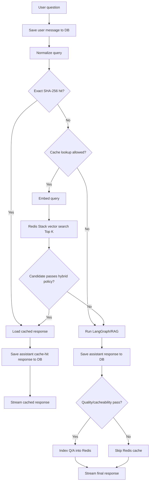

# Redis Semantic Cache Architecture

Tài liệu này mô tả workflow/kiến trúc Redis semantic cache trước khi triển khai code.
Mục tiêu là đảm bảo cơ chế cache nhanh nhưng không làm mất lịch sử hội thoại và hạn chế trả nhầm câu trả lời do semantic hit sai intent.

---

## 1. Mục tiêu

Redis semantic cache được dùng để:

- trả lời nhanh các câu hỏi đã từng được trả lời;
- hỗ trợ hit với câu hỏi tương đồng về nghĩa;
- giảm số lần gọi LangGraph/RAG và LLM;
- vẫn lưu đầy đủ lịch sử hỏi/đáp vào DB.

Redis **không** thay thế DB.
DB/PostgreSQL vẫn là source of truth cho lịch sử hội thoại.

---

## 2. Quyết định kiến trúc

| Hạng mục | Quyết định |
|---|---|
| Source of truth | PostgreSQL/DB |
| Redis role | Cache semantic có thể rebuild |
| Redis runtime | Redis Stack local bằng Docker |
| Vector search | RediSearch KNN vector search |
| Embedding cache | OpenAI `text-embedding-3-small` |
| Vector dimension | 1536 |
| Cache scope phase đầu | Ưu tiên `global` cho câu hỏi RAG kiến thức chung |
| LLM judge | Không dùng |
| Feedback xấu | Phase sau |

> [!IMPORTANT]
> Mọi lượt hỏi/đáp phải được lưu DB dù cache hit hay miss.
> Redis chỉ là lớp tăng tốc, mất Redis không được làm mất lịch sử chat.

---

## 3. Workflow tổng quát



---

## 4. Startup workflow

Khi backend khởi động:

```txt
1. Tạo DB tables như hiện tại.
2. Khởi tạo Redis semantic cache service nếu bật config.
3. Khởi tạo sẵn OpenAIEmbeddings client.
4. Tạo hoặc kiểm tra Redis Stack vector index.
5. Chạy background prewarm N cặp Q/A gần nhất từ DB vào Redis.
6. Nếu Redis lỗi, chỉ log warning/error và backend vẫn chạy.
```

### 4.1. Về “load embedding model trước”

Vì phase này dùng OpenAI `text-embedding-3-small`, backend không load model local vào RAM/GPU.
Startup chỉ khởi tạo sẵn embedding client.

```txt
Exact hit -> không gọi embedding.
Exact miss -> cần gọi embedding API để tạo query vector.
```

Nếu sau này chuyển sang BGE-M3 local thì mới cần load model thật sự trước khi nhận request.

---

## 5. Request workflow chi tiết

### 5.1. Nhận request

Frontend gọi:

```txt
POST /chat/stream
```

Input chính:

```txt
user_id
session_id
user_message
```

### 5.2. Lưu user message vào DB ngay

Backend phải lưu câu hỏi trước khi check cache:

```txt
role = "user"
content = user_message
session_id = current session
user_id = current user
```

Lý do: nếu cache hit và return sớm, lịch sử vẫn không bị thiếu câu hỏi.

### 5.3. Normalize query

Normalize nhẹ để dùng cho exact key, keyword overlap và intent guard:

```txt
- strip khoảng trắng đầu/cuối;
- lowercase;
- gom nhiều khoảng trắng thành một;
- không bỏ dấu tiếng Việt.
```

Ví dụ:

```txt
"  RAG   là gì? " -> "rag là gì?"
```

---

## 6. Exact hit workflow

Tạo exact key bằng SHA-256:

```txt
semantic_cache:exact:{sha256(normalized_query)} -> item_key
```

Nếu có exact hit:

```txt
1. Lấy item payload từ Redis.
2. Kiểm tra quality_status/cache_scope.
3. Stream response từ cache.
4. Lưu assistant response vào DB.
5. Kết thúc request.
```

Metadata assistant DB nên có:

```json
{
  "cache_hit": true,
  "cache_hit_type": "exact",
  "cache_item_key": "semantic_cache:item:..."
}
```

Exact hit không cần gọi embedding.

---

## 7. Exact miss: kiểm tra query có được phép cache lookup không

Mục tiêu bước này là tránh đem các câu phụ thuộc context/user/session đi search cache global.

### 7.1. Output policy

```json
{
  "allowed": true,
  "scope": "global",
  "reason": "general_question"
}
```

hoặc:

```json
{
  "allowed": false,
  "scope": "none",
  "reason": "context_dependent"
}
```

### 7.2. Được phép cache lookup

Các câu hỏi kiến thức chung có thể tái dùng:

```txt
RAG là gì?
Gradient descent hoạt động như thế nào?
Overfitting là gì?
CNN khác MLP ở đâu?
Giải thích backpropagation.
```

Đặc điểm:

- không phụ thuộc lịch sử chat;
- không phụ thuộc nội dung user vừa gửi;
- không chứa code block dài;
- không yêu cầu random/tạo mới;
- thường là câu hỏi RAG kiến thức chung.

### 7.3. Không được phép cache lookup

#### Phụ thuộc lịch sử hội thoại

```txt
tiếp tục
giải thích thêm
ý bạn vừa nói là sao
câu trên nghĩa là gì
phần đó có đúng không
```

#### Phụ thuộc dữ liệu riêng của user

```txt
code của tôi sai ở đâu?
đoạn này lỗi gì?
giải thích file tôi vừa gửi
tóm tắt đoạn văn này
```

#### Yêu cầu tạo mới/random

```txt
tạo 10 câu quiz
cho ví dụ khác
ra đề mới
tạo bài tập mới
```

#### Coding/math cần verifier riêng

Phase đầu không cache global các câu kiểu:

```txt
viết code train CNN
debug code này
giải bài toán này
chứng minh công thức này
```

### 7.4. Pseudo-code

```python
CONTEXT_DEPENDENT_PATTERNS = [
    "câu trên",
    "ở trên",
    "vừa nói",
    "tiếp tục",
    "giải thích thêm",
    "đoạn này",
    "code của tôi",
    "file này",
    "nội dung này",
]

GENERATIVE_PATTERNS = [
    "tạo quiz",
    "tạo câu hỏi",
    "ra đề",
    "cho ví dụ khác",
    "tạo mới",
]


def is_cache_lookup_allowed(query: str) -> dict:
    normalized = normalize_query(query)

    if len(normalized) < 8:
        return {"allowed": False, "scope": "none", "reason": "too_short"}

    if "```" in query:
        return {"allowed": False, "scope": "none", "reason": "contains_code_block"}

    if any(pattern in normalized for pattern in CONTEXT_DEPENDENT_PATTERNS):
        return {"allowed": False, "scope": "none", "reason": "context_dependent"}

    if any(pattern in normalized for pattern in GENERATIVE_PATTERNS):
        return {"allowed": False, "scope": "none", "reason": "generative_request"}

    return {"allowed": True, "scope": "global", "reason": "general_question"}
```

Nếu `allowed=false`, backend bỏ qua Redis semantic lookup và gọi LangGraph/RAG.

---

## 8. Semantic vector search workflow

Nếu exact miss và query được phép lookup:

```txt
1. Tạo embedding cho normalized query.
2. Query Redis Stack KNN top K.
3. Lấy danh sách candidate gần nhất.
4. Chạy hybrid decision policy trên từng candidate.
5. Candidate đầu tiên pass policy sẽ được dùng.
6. Nếu không candidate nào pass, cache miss.
```

Config đề xuất:

```env
SEMANTIC_CACHE_TOP_K=5
```

---

## 9. Candidate decision policy

Redis vector search chỉ trả candidate gần về vector.
Không được dùng ngay candidate đầu tiên nếu chưa qua guard.

Với từng candidate, kiểm tra theo thứ tự:

```txt
1. quality/cache scope
2. vector similarity
3. intent guard
4. keyword overlap nếu cần
```

### 9.1. Quality/cache scope check

Candidate payload cần có metadata:

```json
{
  "quality_status": "ok",
  "cache_scope": "global",
  "cacheable": true,
  "response_type": "rag",
  "response_text": "..."
}
```

Chỉ xét candidate nếu:

```txt
quality_status == "ok"
cacheable == true
cache_scope == "global"
response_text không rỗng
```

Pseudo-code:

```python
def is_candidate_usable(candidate: dict) -> bool:
    if candidate.get("quality_status") != "ok":
        return False
    if candidate.get("cacheable") is False:
        return False
    if candidate.get("cache_scope") != "global":
        return False
    if not candidate.get("response_text"):
        return False
    return True
```

### 9.2. Vector similarity check

Redis COSINE thường trả distance.
Quy đổi:

```txt
similarity = 1 - distance
```

Ngưỡng đề xuất:

```txt
similarity >= 0.95 -> strong semantic candidate
similarity >= 0.90 -> hybrid candidate, cần thêm keyword overlap
similarity < 0.90 -> reject
```

Config:

```env
SEMANTIC_CACHE_STRONG_THRESHOLD=0.95
SEMANTIC_CACHE_HYBRID_THRESHOLD=0.90
```

### 9.3. Intent guard

Intent guard dùng để tránh hit sai kiểu câu hỏi.

Ví dụ không được hit:

```txt
Cached: RAG là gì?
New:    RAG khác fine-tuning như thế nào?
```

Dù vector có thể cao, intent khác nhau.

Nhóm marker đề xuất:

```python
INTENT_MARKERS = {
    "definition": ["là gì", "định nghĩa", "giải thích"],
    "compare": ["so sánh", "khác gì", "khác nhau", "phân biệt"],
    "how": ["hoạt động", "như thế nào", "cách"],
    "why": ["tại sao", "vì sao"],
    "example": ["ví dụ", "minh họa"],
    "pros_cons": ["ưu điểm", "nhược điểm", "hạn chế"],
    "formula": ["công thức", "đạo hàm", "gradient"],
    "code": ["code", "python", "implement", "viết chương trình"],
}
```

Pseudo-code:

```python
def detect_intents(query: str) -> set[str]:
    normalized = normalize_query(query)
    intents = set()

    for intent, markers in INTENT_MARKERS.items():
        if any(marker in normalized for marker in markers):
            intents.add(intent)

    if not intents:
        intents.add("general")

    return intents


def same_intent(new_query: str, cached_query: str) -> bool:
    new_intents = detect_intents(new_query)
    cached_intents = detect_intents(cached_query)

    if new_intents == cached_intents:
        return True

    safe_pairs = [
        ({"definition"}, {"general"}),
        ({"general"}, {"definition"}),
    ]
    return (new_intents, cached_intents) in safe_pairs
```

### 9.4. Keyword overlap check

Keyword overlap là lexical guard để giảm false positive.
Nên dùng containment overlap thay vì Jaccard thuần vì câu hỏi ngắn dễ bị Jaccard thấp.

Công thức:

```txt
overlap = common_keywords / min(len(query_keywords), len(cached_keywords))
```

Ví dụ hit tốt:

```txt
Cached: RAG là gì?
New:    Bạn giải thích RAG là gì được không?
```

Keyword chính đều chứa `rag`, intent cùng definition.

Config:

```env
SEMANTIC_CACHE_KEYWORD_OVERLAP=0.55
```

Pseudo-code:

```python
VIETNAMESE_STOPWORDS = {
    "là", "gì", "của", "và", "thì", "mà", "có",
    "cho", "tôi", "bạn", "được", "không", "như",
}


def extract_keywords(query: str) -> set[str]:
    normalized = normalize_query(query)
    tokens = normalized.split()
    return {token for token in tokens if token not in VIETNAMESE_STOPWORDS}


def keyword_overlap(query: str, cached_query: str) -> float:
    q_tokens = extract_keywords(query)
    c_tokens = extract_keywords(cached_query)

    if not q_tokens or not c_tokens:
        return 0.0

    common = q_tokens & c_tokens
    return len(common) / min(len(q_tokens), len(c_tokens))
```

---

## 10. Hit decision hoàn chỉnh

```python
def should_use_candidate(new_query: str, candidate: dict) -> dict:
    if not is_candidate_usable(candidate):
        return {"hit": False, "reason": "candidate_not_usable"}

    cached_query = candidate["prompt"]
    similarity = candidate["similarity"]

    if similarity < HYBRID_THRESHOLD:
        return {"hit": False, "reason": "below_vector_threshold"}

    if not same_intent(new_query, cached_query):
        return {"hit": False, "reason": "intent_mismatch"}

    if similarity >= STRONG_THRESHOLD:
        return {
            "hit": True,
            "reason": "strong_semantic_hit",
            "similarity": similarity,
        }

    overlap = keyword_overlap(new_query, cached_query)

    if overlap >= KEYWORD_OVERLAP_THRESHOLD:
        return {
            "hit": True,
            "reason": "hybrid_semantic_keyword_hit",
            "similarity": similarity,
            "keyword_overlap": overlap,
        }

    return {
        "hit": False,
        "reason": "keyword_overlap_too_low",
        "similarity": similarity,
        "keyword_overlap": overlap,
    }
```

Decision summary:

| Case | Điều kiện | Kết quả |
|---|---|---|
| Exact hit | SHA-256 match | Hit ngay |
| Strong semantic hit | similarity >= 0.95 + same intent | Hit |
| Hybrid hit | similarity >= 0.90 + same intent + keyword overlap >= 0.55 | Hit |
| Không đạt | Bất kỳ guard fail | Miss, gọi LangGraph/RAG |

---

## 11. DB persistence workflow

DB luôn lưu đầy đủ question và response.
Mỗi lượt chat tạo 2 dòng trong `chat_history`:

```txt
1. role = "user"
   content = question

2. role = "assistant"
   content = response
```

### 11.1. Cache hit

```txt
User hỏi
-> lưu user vào DB
-> Redis exact/semantic hit
-> lấy cached response
-> lưu assistant vào DB với agent_type="cache"
-> stream response
```

Metadata assistant nên có:

```json
{
  "cache_hit": true,
  "cache_hit_type": "semantic_hybrid",
  "cache_reason": "hybrid_semantic_keyword_hit",
  "similarity": 0.93,
  "keyword_overlap": 0.71,
  "cache_item_key": "semantic_cache:item:..."
}
```

### 11.2. Cache miss

```txt
User hỏi
-> lưu user vào DB
-> cache miss hoặc lookup không allowed
-> gọi LangGraph/RAG
-> lưu assistant vào DB
-> nếu response đạt quality gate thì index vào Redis
-> stream response
```

Metadata assistant nên có:

```json
{
  "cache_hit": false,
  "cache_miss_reason": "intent_mismatch",
  "cacheable": true,
  "quality_status": "ok"
}
```

---

## 12. Cache write workflow

Sau khi LangGraph/RAG trả response:

```txt
1. Lưu assistant response vào DB.
2. Chạy quality/cacheability filter.
3. Nếu không cacheable, dừng.
4. Normalize prompt.
5. Tạo embedding prompt.
6. Tạo item key.
7. Lưu payload Redis HASH.
8. Lưu exact mapping SHA-256 -> item key.
9. Redis Stack tự index item theo prefix.
```

Quality/cacheability filter phase đầu:

```txt
- response.type == "rag"
- response.text không rỗng
- response không phải error
- query không phụ thuộc context/session
- query không chứa code block dài
- nếu là RAG thì có citation/source nếu metadata có
- response không có dấu hiệu “không chắc”, “không tìm thấy”
```

---

## 13. Redis data model

### 13.1. Keys

```txt
semantic_cache:exact:{sha256(normalized_prompt)} -> semantic_cache:item:{uuid}
semantic_cache:item:{uuid} -> Redis HASH payload
idx:semantic_cache -> RediSearch index
```

### 13.2. Item payload

```json
{
  "prompt": "RAG là gì?",
  "normalized_prompt": "rag là gì?",
  "response_json": "{...}",
  "response_text": "...",
  "response_type": "rag",
  "cache_scope": "global",
  "cacheable": true,
  "quality_status": "ok",
  "created_at": 1714480000,
  "embedding": "<binary vector>"
}
```

### 13.3. Redis client requirement

Auth/rate limit client hiện tại dùng `decode_responses=True`.
Semantic vector cache cần client riêng:

```txt
decode_responses=False
```

Lý do: embedding vector cần lưu dạng binary bytes.

---

## 14. Prewarm workflow

Khi backend start và `SEMANTIC_CACHE_PREWARM_ENABLED=True`:

```txt
1. Query N messages gần nhất từ chat_history.
2. Group theo user_id + session_id.
3. Sort theo created_at asc.
4. Ghép cặp user -> assistant ngay sau đó.
5. Skip pair không hợp lệ.
6. Chạy quality/cacheability filter.
7. Nếu pass và Redis chưa có exact key, index vào Redis.
```

Skip nếu:

```txt
- assistant không có user trước đó;
- user không có assistant sau đó;
- assistant text rỗng;
- metadata_json.type == "error";
- pair bị lệch do bug cũ;
- response không cacheable.
```

Prewarm chạy background và không được làm backend fail startup.

---

## 15. Config đề xuất

```env
REDIS_URL=redis://localhost:6379/0
SEMANTIC_CACHE_ENABLED=True
SEMANTIC_CACHE_BACKEND=redis_stack
SEMANTIC_CACHE_EMBEDDING_MODEL=text-embedding-3-small
SEMANTIC_CACHE_VECTOR_DIM=1536
SEMANTIC_CACHE_TOP_K=5
SEMANTIC_CACHE_STRONG_THRESHOLD=0.95
SEMANTIC_CACHE_HYBRID_THRESHOLD=0.90
SEMANTIC_CACHE_KEYWORD_OVERLAP=0.55
SEMANTIC_CACHE_TTL_SECONDS=86400
SEMANTIC_CACHE_PREWARM_ENABLED=True
SEMANTIC_CACHE_PREWARM_LIMIT=1000
```

---

## 16. Ví dụ quyết định hit/miss

### 16.1. Exact hit

```txt
Cached: RAG là gì?
New:    RAG là gì?
```

Kết quả:

```txt
Exact SHA-256 hit -> trả cache ngay.
```

### 16.2. Hybrid hit đúng

```txt
Cached: RAG là gì?
New:    Bạn giải thích RAG là gì được không?
```

Giả định:

```txt
similarity = 0.93
keyword_overlap = 1.0
same_intent = true
quality_status = ok
cache_scope = global
```

Kết quả:

```txt
Hit vì hybrid_semantic_keyword_hit.
```

### 16.3. Miss do intent mismatch

```txt
Cached: RAG là gì?
New:    RAG khác fine-tuning như thế nào?
```

Giả định:

```txt
similarity = 0.91
keyword_overlap = 1.0
same_intent = false
```

Kết quả:

```txt
Miss, gọi LangGraph/RAG.
```

### 16.4. Miss do context dependent

```txt
New: giải thích câu trên thêm đi
```

Kết quả:

```txt
Cache lookup not allowed -> gọi LangGraph/RAG.
```

### 16.5. Miss do quality

```txt
Candidate quality_status = low_confidence
```

Kết quả:

```txt
Reject candidate -> xét candidate tiếp theo hoặc gọi LangGraph/RAG.
```

---

## 17. Implementation boundaries

Phase đầu **không làm**:

- không dùng LLM judge;
- không thêm feedback endpoint;
- không đổi schema DB nếu chưa cần;
- không đổi API contract frontend;
- không cache global cho coding/math/quiz/random generation;
- không dùng Redis làm source of truth.

Phase đầu **cần làm**:

- lưu user trước cache lookup;
- lưu assistant dù cache hit hay miss;
- exact SHA-256 cache;
- Redis Stack vector search;
- hybrid candidate policy;
- quality/cacheability filter;
- startup ensure index;
- background prewarm từ DB;
- fallback an toàn khi Redis lỗi.

---

## 18. Checklist đọc trước khi code

- [ ] Đã hiểu DB luôn lưu question + response.
- [ ] Đã hiểu Redis chỉ là cache có thể rebuild.
- [ ] Đã hiểu exact hit không cần embedding.
- [ ] Đã hiểu exact miss mới cần embedding + vector search.
- [ ] Đã hiểu không phải query nào cũng được semantic lookup.
- [ ] Đã hiểu candidate vector search phải qua intent/keyword/quality guard.
- [ ] Đã hiểu Redis lỗi không được làm backend fail.
- [ ] Đã hiểu phase đầu không dùng LLM judge.
