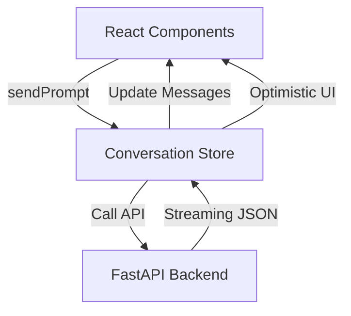

# 🏗️ Kiến trúc Frontend - RAG QABot

Tài liệu này mô tả chi tiết các quyết định kiến trúc, luồng dữ liệu và cách Frontend tương tác với hệ thống Multi-Agent Backend.

---

## 1. Luồng dữ liệu (State Management Flow)

Dự án sử dụng **Zustand** được bọc trong một **React Context Provider** (`ConversationStoreProvider`) để quản lý trạng thái hội thoại. 

### Sơ đồ tương tác:

### Các tính năng đặc biệt của Store:
- **Streaming Real-time**: Sử dụng `TextDecoder` để giải mã stream từ Backend và cập nhật từng token vào tin nhắn Assistant.
- **Optimistic UI**: Hiển thị tin nhắn của người dùng ngay lập tức trước khi nhận phản hồi từ server.
- **Auto-retry**: Cơ chế lưu trữ `failedPromptState` để cho phép người dùng thử lại khi có lỗi mạng.
- **Session Management**: Tự động quản lý `conversationId` để duy trì ngữ cảnh cho Supervisor Agent ở Backend.

---

## 2. Tương tác với Multi-Agent System

Frontend được thiết kế để hỗ trợ luồng làm việc của nhiều Agent chuyên trách:

- **Supervisor Routing**: Mọi câu hỏi từ Chatspace đều đi qua Supervisor Agent. Frontend hiển thị trạng thái `streamingStatus` để người dùng biết Agent nào đang xử lý (ví dụ: "Tutor đang tìm kiếm...", "Math Agent đang giải toán...").
- **Context Injection**: 
    - Khi chuyển từ **Summary Hub** sang **Chatspace**, bản tóm tắt được tự động "tiêm" (inject) vào lịch sử tin nhắn.
    - Điều này đảm bảo Supervisor Agent nhận diện được ngữ cảnh video mà không cần người dùng phải cung cấp lại thông tin.

---

## 3. Các thành phần giao diện chính (UI Patterns)

### 🧩 Markdown Renderer
Thành phần phức tạp nhất trong hệ thống, chịu trách nhiệm render kết quả từ LLM:
- **Code Sandbox**: Hiển thị code với Syntax Highlighting và nút sao chép nhanh.
- **Math Engine**: Sử dụng KaTeX để render các công thức toán học phức tạp từ Math Agent.
- **Table Support**: Hỗ trợ bảng biểu Markdown (GFM).

### 🔍 Citation System
Khi Tutor Agent trả về kết quả RAG, dữ liệu bao gồm các `citations` (nguồn tham khảo). 
- Frontend sẽ trích xuất và hiển thị danh sách video/mốc thời gian tương ứng.
- Người dùng có thể nhấn vào để mở trực tiếp video bài giảng tại mốc thời gian đó.

### ⚡ Performance Optimization (Gateway Page)
- **Framer Motion Spring**: Sử dụng cơ chế lò xo cho hiệu ứng co giãn thẻ để tránh hiện tượng khựng (lag) khi di chuyển chuột nhanh giữa các không gian.
- **React.memo**: Được áp dụng cho các thẻ bài giảng và thẻ không gian để tối ưu hóa việc render lại.

---

## 4. Giao tiếp API (API Communication)

Toàn bộ các cuộc gọi API được tập trung trong thư mục `src/lib/api/`:
- **Base Client**: Cấu hình Fetch API với các headers mặc định.
- **Streaming Parser**: Logic đặc biệt để tách JSON metadata khỏi luồng văn bản thuần túy của LLM, giúp UI có thể hiển thị cả nội dung tóm tắt và các metadata kèm theo đồng thời.

---

## 5. Thiết kế Hệ thống (Design System)

- **Colors**: Hệ màu Slate/Violet/Cyan hiện đại, chuyên nghiệp cho môi trường giáo dục.
- **Typography**: Sử dụng font *Plus Jakarta Sans* cho tiêu đề và các thành phần UI để tạo cảm giác State-of-the-art.
- **Micro-interactions**: Hiệu ứng Pulse khi loading, hiệu ứng Slide-in khi có tin nhắn mới, giúp ứng dụng cảm giác "sống động" hơn.
